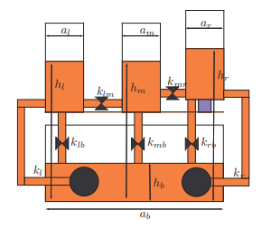

# 🌊 Fault Detection and Isolation (FDI) for a Three-Tank System

This repository contains the implementation of a project focused on **diagnostics and monitoring** for a classic three-tank water system. Due to its non-linear dynamics and tank couplings, it serves as an ideal testbed for control and diagnostic algorithms. The primary method used for Fault Detection and Isolation (FDI) is **residual analysis**, based on a linearized state-space model and the Luenberger observer approach.

### 🖼️ System Schematic

The diagram above illustrates the interconnected three-tank system, showing the main tanks ($h_l, h_m, h_r$) and the lower buffer tank ($h_b$), along with flow coefficients ($k$) and cross-sectional areas ($a$).

---

## ✨ Project Goal

The main objective was to design and test a system capable of:
* **Modeling** the dynamic behavior of the three-tank system.
* **Simulating** normal operation and various fault conditions (e.g., pump failure, flow blockage, sensor noise).
* **Detecting** and **localizing** faults using state observers and residual analysis.
* **Differentiating** between different fault types (e.g., pump vs. valve failures) by analyzing the signature (sign and timing) of the residuals.

---

## ⚙️ Methodology

The core of the FDI system relies on **Model-Based Diagnostics**.

1.  **Mathematical Model:** The system is described by a non-linear fourth-order model, which is reduced to a third-order state vector $x=[h_l, h_m, h_r]$ by assuming a constant total volume.
2.  **Linearization:** The non-linear model is linearized around the stable operating point: $x_0=(41, 39, 40.39)[\text{cm}]$ and $u_0=(4.35, 8.76)[\text{V}]$.
3.  **Residual Generation:** Residuals are calculated as the difference between the expected output $\hat{y}(k)$ of the model and the actual measurement $y(k)$. The Luenberger observer is commonly used for state estimation.
4.  **Fault Detection:** A fault is detected when the magnitude of a residual $|r_{i}(k)|$ exceeds a predefined threshold $\tau_{i}$ (e.g., $\pm 2 \text{ cm}$ for water level residuals).

---

## 🚨 Simulated Faults

The simulation includes various faults to test the diagnostic capability.

| Fault Type | Localization/Classification Signature |
| :--- | :--- |
| **Pump Failure** | All level residuals ($\text{Residual } h_L, \text{ Residual } h_M, \text{ Residual } h_R$) have the **same sign**. The first deviation appears in the tank connected to the faulty pump and propagates with delay. |
| **Flow Blockage** | Level residuals show **different signs** between tanks (e.g., $\text{Residual } h_L$ rising, $\text{Residual } h_M$ and $\text{Residual } h_R$ falling). This is the key difference for classification versus a pump fault. |
| **Sensor Fault** | **Only the residual for the faulty sensor** shows large, random deviations (e.g., $\text{Residual } h_R$), while other residuals remain stable, as the fault does not affect system dynamics. |
| **Tank Silting** | Gradual and slow change in residuals over time. Detection relies on analyzing the cumulative change or integrated residuals over time. |

---

## 📂 Repository Contents

* `diagnostics.m`: The main MATLAB script for running normal and faulty simulations, handling data interpolation, noise addition, residual calculation, and generating diagnostic plots.
* `three_tank_model.m`: Function defining the non-linear dynamics of the **healthy** three-tank system (used to generate nominal data).
* `three_tank_model_faulty.m`: Function defining the non-linear dynamics, where specific faults can be activated at given times (used to generate faulty data).
* `project_raport.pdf`: The full project report (in Polish) detailing the theoretical background, mathematical model, linearization, observer design, and simulation results.

---

## 🛠️ Usage

To run the simulation and generate the plots, execute the `diagnostics.m` script in the MATLAB environment. Note that the type and time of the fault are controlled within the `three_tank_model_faulty.m` function by uncommenting the relevant code section (e.g., the current version simulates a total pump failure at $t=120 \text{s}$).

**Dependencies:** MATLAB with basic toolboxes (required for ODE solving, e.g., `ode45`).
